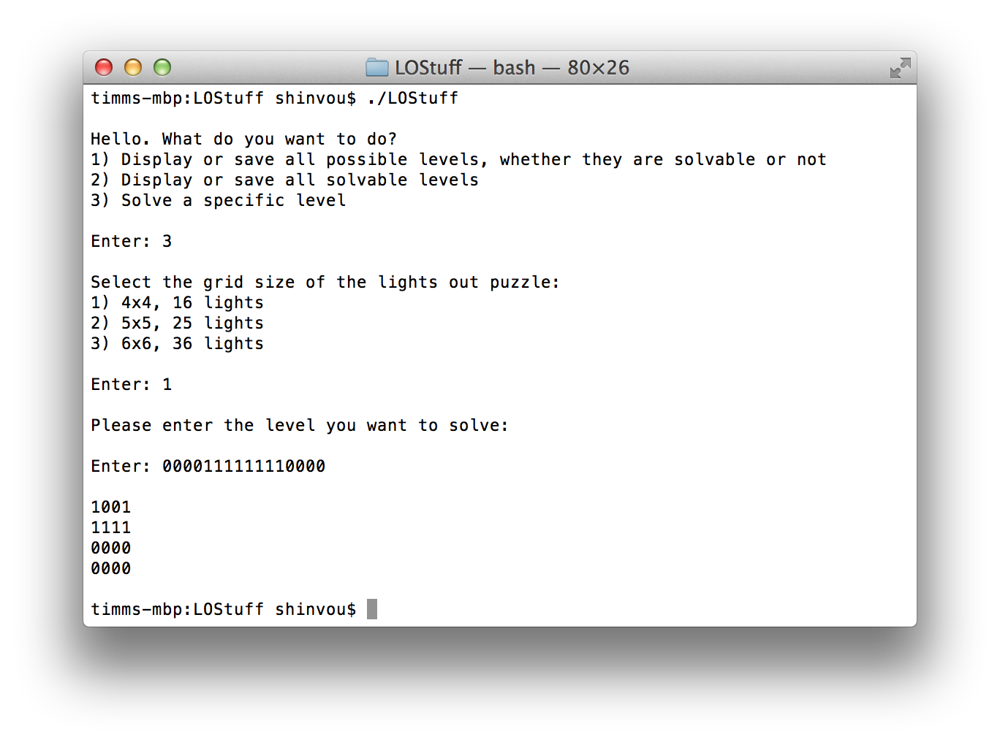

# LOStuff
## Do everything you need for Lights Out

### Intro
LOStuff is a command-line interface for creating and solving Lights Out puzzles, featuring a creative name.

I created this for [Lights Out for iOS 7](https://itunes.apple.com/de/app/lights-out-for-ios-7/id800618006?mt=8).

This actually was my first program written in C.

### How do I LOStuff?
It literally is self-explaining. ;P

Further explanation: '1' means activated light, '0' means deactivated light. For a level solution '1' represents the light one has to select/press/touch/click/tap.

### How do I get?
Compile it for yourself, that shouldn't be too hard as it's C.

### How do I compile?
You should know that. :P

### License?
Pretty much the BSD license, just don't repackage it and call it your own please!

Also if you do make some changes, feel free to make a pull request and help make things more awesome!

### Contact Info?
If you have any support requests please feel free to email me at shinvou[at]gmail[dot]com.

Otherwise, feel free to follow me on twitter: [@biscoditch](https:///www.twitter.com/biscoditch)!

### Special Thanks
/
